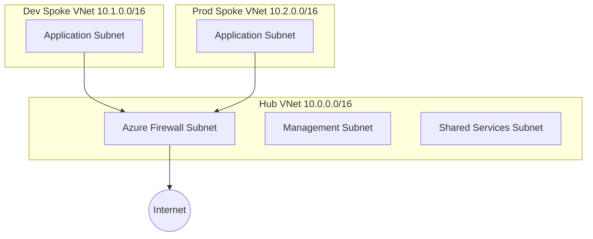

# Azure Landing Zones – Hub and Spoke Architecture (Terraform)

This repository demonstrates a simplified **Azure Landing Zone network architecture** built using **Terraform Infrastructure as Code**.

The goal of this project is to provide a reusable foundation for deploying Azure environments that follow **enterprise networking best practices**, including hub-and-spoke design, environment isolation, and centralized security.

This project is intended as a **learning and demonstration implementation** of Azure platform engineering concepts such as infrastructure automation, network segmentation, and cloud governance.

---

# Architecture Overview

The deployment follows a **hub-and-spoke network topology**.

The **Hub Virtual Network** hosts shared services and central security components, while **Spoke Virtual Networks** host application workloads for different environments.

Key design principles:

• Centralized security and management
• Environment isolation for workloads
• Scalable network structure
• Infrastructure deployed using Terraform

---

# Architecture Diagram



---

# Network Design

The project uses private IP address ranges defined by RFC1918.

Hub network:

Hub VNet
10.0.0.0/16

Subnets

AzureFirewallSubnet
10.0.0.0/24

ManagementSubnet
10.0.1.0/24

SharedServicesSubnet
10.0.2.0/24

Spoke networks

Dev Spoke VNet
10.1.0.0/16

ApplicationSubnet
10.1.1.0/24

Prod Spoke VNet
10.2.0.0/16

ApplicationSubnet
10.2.1.0/24

---

# What This Deployment Demonstrates

This repository demonstrates several key Azure platform engineering concepts:

Terraform Infrastructure as Code
Azure Virtual Networks and Subnets
Hub and Spoke network architecture
Network segmentation
VNet Peering between hub and spoke networks
Environment isolation for Dev and Production workloads

These patterns are commonly used in enterprise Azure environments and align with **Microsoft Cloud Adoption Framework landing zone guidance**.

---

# Repository Structure

```
azure-landing-zones/
│
├── README.md
│
├── terraform/
│   ├── main.tf
│   ├── variables.tf
│   └── outputs.tf
│
├── examples/
│   └── sample.tfvars
│
└── diagrams/
    └── architecture.png
```

---

# Prerequisites

Before deploying this infrastructure you will need:

• Azure subscription
• Terraform installed (v1.5+ recommended)
• Azure CLI installed
• Contributor permissions in the target subscription

---

# Deployment Steps

Clone the repository

```
git clone https://github.com/madhupsheen/azure-landing-zones.git
cd azure-landing-zones/terraform
```

Login to Azure

```
az login
```

Initialize Terraform

```
terraform init
```

Review deployment plan

```
terraform plan
```

Deploy infrastructure

```
terraform apply
```

---

# Example Variables

Example configuration is provided in:

```
examples/sample.tfvars
```

Example values:

```
location = "Australia East"
resource_group_name = "rg-landing-zone-network"
```

---

# Future Improvements

This project can be extended with additional landing zone components:

• Azure Firewall deployment
• Network Security Groups
• Route tables and forced tunnelling
• Azure Policy assignments
• Log Analytics and monitoring
• Azure Bastion for secure management access
• Hybrid connectivity with Azure Arc or VPN

---

# Learning Objectives

This project was created to demonstrate hands-on experience with:

Azure platform engineering
Infrastructure automation using Terraform
Secure cloud networking design
Enterprise landing zone patterns

---

# License

MIT License
