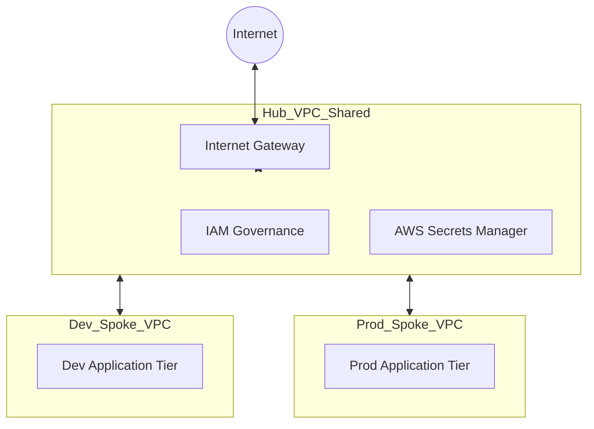

# Multi-Cloud Platform Foundations (Terraform)

This repository demonstrates a **Security-by-Design** approach to cloud infrastructure. The goal is to establish a **"Golden Path" to production**—providing secure, scalable, and self-service infrastructure patterns that empower development teams to ship code faster.

This project showcases the translation of **Hub-and-Spoke Networking** and **Automated Governance** across both AWS and Azure using modular Terraform.

---

# 1. AWS Platform Architecture
*Located in `/aws-infra`*

This architecture focuses on cloud-native SaaS delivery, mirroring the requirements for a secure, isolated production environment.

### **Architecture Diagram**


### **VPC Design & Segmentation**

| VPC Type | CIDR Block | Primary Purpose |
| :--- | :--- | :--- |
| **Hub VPC** | `10.0.0.0/16` | Shared services, security inspection, and IAM governance. |
| **Dev Spoke** | `10.1.0.0/16` | Isolated development environment for stream-aligned teams. |
| **Prod Spoke**| `10.2.0.0/16` | Hardened production environment for application workloads. |

### **Key Technical Features**
*   **Identity Governance:** Automated **IAM Role** provisioning with least-privilege trust policies.
*   **Secrets Management:** Integration with **AWS Secrets Manager** to ensure zero-trust credential handling.
*   **Availability:** Designed for Multi-AZ subnet distribution to ensure platform reliability.
*   **Security-by-Design:** Strict Security Group rules and resource-level tagging for lifecycle management.

---

# 2. Azure Landing Zone Architecture
*Located in `/azure-infra`*

This section follows the **Cloud Adoption Framework (CAF)** patterns for enterprise-scale networking and centralized security.

### **Architecture Diagram**


### **Architecture Breakdown**
*   **Hub VNet (10.0.0.0/16):** Hosts the `AzureFirewallSubnet`, `ManagementSubnet`, and `SharedServicesSubnet`.
*   **Spoke VNets:** Workload isolation for **Dev (10.1.0.0/16)** and **Prod (10.2.0.0/16)**.
*   **Connectivity:** High-performance **VNet Peering** allows spokes to route traffic through the Hub for centralized security.

---

# Deployment & Usage

### **Prerequisites**
*   **Terraform** (v1.5.0 or later)
*   **AWS CLI** & **Azure CLI** configured with appropriate permissions.

### **Quick Start**
1.  **Clone the repository:**
    ```bash
    git clone https://github.com
    cd multi-cloud-platform-foundations
    ```
2.  **Deploy AWS Infrastructure:**
    ```bash
    cd aws-infra
    terraform init
    terraform plan -var-file="aws-sample.tfvars"
    terraform apply
    ```
3.  **Deploy Azure Infrastructure:**
    ```bash
    cd ../azure-infra
    terraform init
    terraform apply -var-file="azure-sample.tfvars"
    ```

---

# Platform Engineering Principles
1.  **Infrastructure as Code (IaC):** 100% automated for repeatable, documented deployments.
2.  **Developer Experience (DevEx):** Modular code structure that reduces manual friction for developers.
3.  **Governance:** Centralized secrets management and strict identity access controls.
4.  **Observability-Ready:** Designed to integrate with Prometheus, Grafana, or native cloud logging.

# License
MIT License
