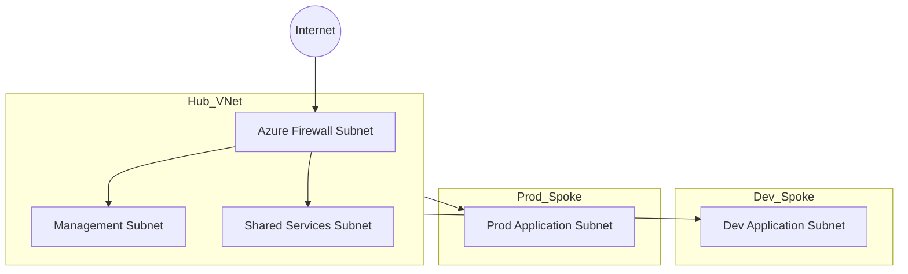

# Azure Landing Zone – Hub and Spoke Architecture (Terraform)

This repository demonstrates a simplified **Azure Landing Zone hub-and-spoke network architecture** built using **Terraform Infrastructure as Code (IaC)**.

The goal of this project is to show how Azure environments can be structured using **enterprise networking patterns**, including centralized security, isolated workloads, and scalable cloud architecture.

This project focuses on:

• Hub and Spoke network design
• Infrastructure automation using Terraform
• Network segmentation for Dev and Production environments
• Reusable Azure infrastructure patterns

The architecture reflects common practices used in enterprise cloud environments.

---

# Architecture Diagram



---

# Architecture Overview

This architecture follows a **hub-and-spoke model**.

## Hub Virtual Network

The hub network contains shared infrastructure and central security services.

Hub VNet CIDR

10.0.0.0/16

Subnets

AzureFirewallSubnet – 10.0.0.0/24
ManagementSubnet – 10.0.1.0/24
SharedServicesSubnet – 10.0.2.0/24

The hub is designed to host:

• Centralized firewall and security inspection
• Shared management services
• Monitoring and platform tools

---

## Spoke Networks

Spoke networks host application workloads and connect to the hub.

### Dev Spoke

CIDR

10.1.0.0/16

Subnet

ApplicationSubnet – 10.1.1.0/24

---

### Prod Spoke

CIDR

10.2.0.0/16

Subnet

ApplicationSubnet – 10.2.1.0/24

---

# Network Connectivity

The spoke networks connect to the hub using **VNet peering**.

Traffic flows through the hub network where security controls can be applied.

Typical traffic pattern

Workload → Hub Network → Firewall → Internet

---

# Repository Structure

```
azure-landing-zones
│
├── README.md
│
├── terraform
│   ├── main.tf
│   ├── variables.tf
│   ├── outputs.tf
│   └── versions.tf
│
└── examples
    └── sample.tfvars
```

---

# Prerequisites

To deploy this infrastructure you will need:

• Azure subscription
• Terraform installed (v1.5 or later recommended)
• Azure CLI installed
• Contributor permissions on the Azure subscription

---

# Deployment

Clone the repository

```
git clone https://github.com/madhupsheen/azure-landing-zones.git
cd azure-landing-zones/terraform
```

Login to Azure

```
az login
```

Initialize Terraform

```
terraform init
```

Preview the deployment

```
terraform plan
```

Deploy the infrastructure

```
terraform apply
```

---

# Example Variables

Example configuration is provided in:

```
examples/sample.tfvars
```

Example values

```
location = "Australia East"
resource_group_name = "rg-landing-zone-network"
```

---

# Learning Goals

This repository demonstrates practical experience with:

Azure Virtual Networks
Hub-and-Spoke architecture
Infrastructure as Code using Terraform
Cloud networking design patterns
Environment isolation for workloads

---

# Future Enhancements

Possible improvements to this architecture include:

• Azure Firewall deployment
• Network Security Groups
• User Defined Routes (UDR)
• Azure Bastion for secure access
• Log Analytics and monitoring
• Hybrid connectivity using VPN or Azure Arc

---

# License

MIT License
